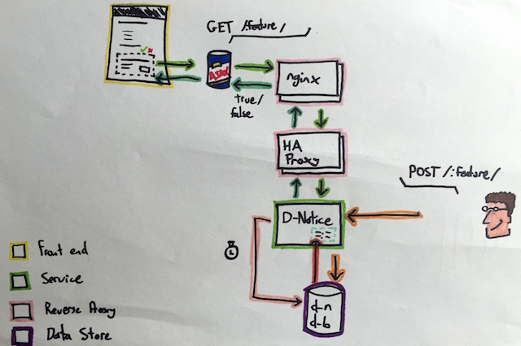

## 000X - Title
###### Author(s) - Ray Hannity (include Authors here)
## Introduction
Introduction to design change, including context of decision. State briefly the user need being met.

## Detail

### Section
Detail of design section. You __might__ want to think about including:

:+1: A picture of the components affected by the design. Extra marks for nicely drawn cartoon pictures.  
:+1: A description of how you are going to deploy and test the design. 

>If you're about to include any of the following in your design, think again, then once more to be sure:
>
>:-1: Code. You haven't written any code yet :)  
>:-1: Pseudocode. If you find yourself writing a complex algorithm then there's a slim chance you might need this. If in doubt, don't.  
>:-1: Specification. This is about how it works (design), not about what is is (specification). 

#### Sub Section
Sub section of design

* Include Supporting Files, e.g. json/xml/whatever in sub folder
* Include links to relevant repos or external resources
* Include supporting images in sub-folder

### How much detail should I put in?

How much of the system does your change affect? For application changes, familiarise yourself with [Simon Brown's useful 4Cs diagram style](http://static.codingthearchitecture.com/c4.pdf). If the design of this functionality changes the Context diagram you [should] have of the system then provide an updated Context diagram. If the design changes the Containers diagram you have then provide an updated Containers diagram. Any change sufficient in size or complexity to demand an ODP should imply a Component level diagram for the design.

A Class diagram _should_ be unnecessary at this stage unless the design deals specifically with some complex low level details. Bear in mind that supplying a Class diagram before the team have started implementation may prescribe the decisions that should be delegated to the people implementing the change.

A diagram doesn't have to be a perfect keynote-worthy Visio artefact, it just needs to be clear enough and consistent enough to convey the information required. Phone camera and whiteboard & marker or paper & sharpie are usually good, especially if you are capturing a diagram that has changed frequently under discussion.

  
_An example diagram, by rory80hz_

> Some Useful Tools
> 
>* [This Markdown cheatsheet](https://github.com/gitlabhq/gitlabhq/blob/master/doc/markdown/markdown.md)
>* For sequence diagrams [https://www.websequencediagrams.com/](https://www.websequencediagrams.com/)
>* If you really want fancy boxes [Draw.io](https://www.draw.io/)
>* If you want to edit markdown try [http://dillinger.io/](http://dillinger.io/) or [Light Paper](http://www.ashokgelal.com/lightpaper-for-mac/)

## Questions to consider

For new components:

* do we need a new code repository?
* what is the project structure (e.g. subprojects, client/API/service split)?
* what are the recommended techs? 
    * summarise techs and purpose, e.g. "JerseyClient, for HTTP API client calls"
    * include brief justification for different techs for same behaviours we already have
    * flag up any commercial or GPL licenses for new techs
* how will the project be built as part of CI, and where does it fit in the pipeline?

For downstream interface points:

* does this need new endpoints or updates to existing ones?
* do we need new request/response objects?
* are we following project convention with paths, params and HTTP verbs?
* how can we handle failure, or unacceptably slow responses of the downstream endpoint?
* *has this actually been agreed with the team/organisation responsible for the downstream client/service?*

Also ask yourself these questions about your design: 

* has everyone been involved in the discussion (dev, ops, qa, sec, ba etc.)?
* how does this meet the user need?
* does this design change the physical architecture?
* how will this change be deployed and configured?
* how will this be performance tested against realistic demand/live data?
* how can this be scaled to handle double the demand? (Up? Out?)
* how do the components involved react to individual or wholesale failure?
* how will errors and exceptions be handled and logged?
* how will this part of the service be maintained, debugged or operated while live?
* have you tied in to centralised logging and monitoring?
* do we need new firewall rules or other changes to existing infrastructure?
* will there be DB updates or data migrations?

## Design Comments

1 - Track questions and issues including person asking question, and responses.

RH: Should we include tags for task tracker stories / journeys? Worth thinking about...

HC: Where do we track options/technologies which were considered and rejected and why they were rejected? Useful to have a history.
In comments, or by creating an ODP with a status of 'on hold'